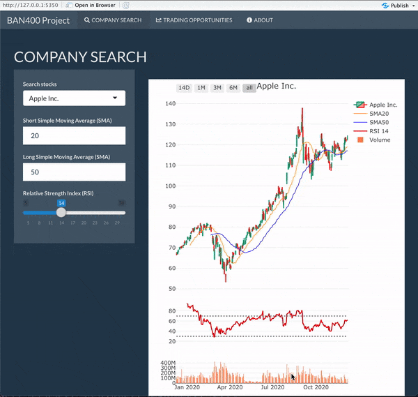

# BAN400 Project
`BAN400 Shiny.R` is a simple app designed to provide information on
trading possibilities in the stock market.

### Motivation
The program is written as a part of the course
[BAN400](https://www.nhh.no/en/courses/r-programming-for-data-science/),
"R programming for computer science", at [Norwegian School of
Economics](https://www.nhh.no/en/). It is created by students, as the final
assessment in the course.
### Features
The app has three main features.
1. `Company search` allows the user to search between different stocks
in order to display a graphical representation of the relevant stock's price,
short and long simple moving average curves, and the relative strength index
in the chosen time period (ranging from a 14 day interval to a full year).
2. `Trading opportunities` presents the up-to-date trading signals for the
relevant day. The user can change lower and higher RSI-cutoffs to make it suit
his/her personal trading style better, as well as filter by sector.
3. `About` is lastly a page that provides general information on how to use
the app.
### How to use
The app is ready to use without any user modifications. Simply open the file
`BAN400 Shiny.R` in a relevant IDE (we suggest [RStudio](https://rstudio.com))
and run it. The required libraries are downloaded and imported in the script,
but if you already have them downloaded you may skip/delete the `Packages`-part
in the first lines of the code.
### Credits
Add names or candidate numbers

